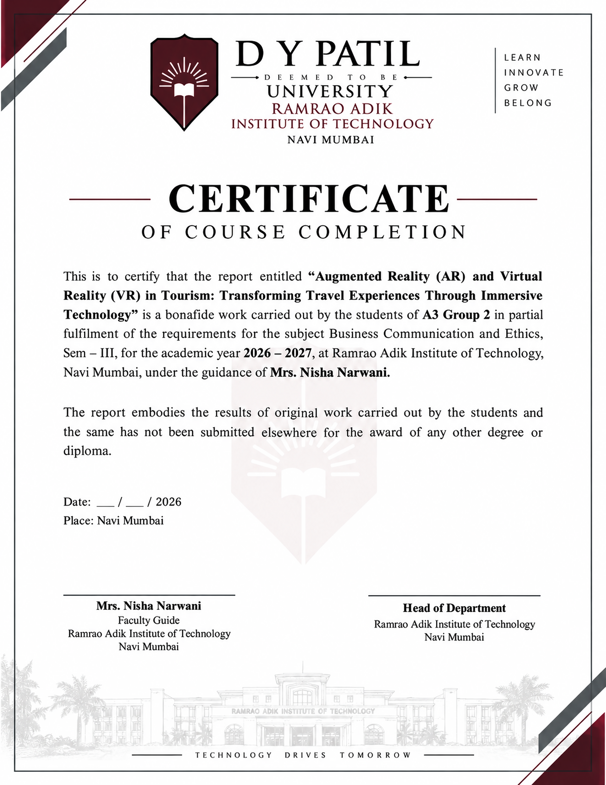

# report-iee

Enhanced course completion certificate for Business Communication and Ethics:
* **Topic**: *Augmented Reality (AR) and Virtual Reality (VR) in Tourism: Transforming Travel Experiences Through Immersive Technology*
* **Group**: A3 Group 2 (Sem – III, Academic Year 2026 – 2027)
* **Guide**: Mrs. Nisha Narwani
* **Institute**: Ramrao Adik Institute of Technology, D Y Patil Deemed to be University, Navi Mumbai

### Deliverables
- [`certificate.png`](certificate.png) — Enhanced 300+ DPI high-resolution certificate image (3306 × 4281 px)
- [`certificate.pdf`](certificate.pdf) — Print-ready PDF document

---

  

